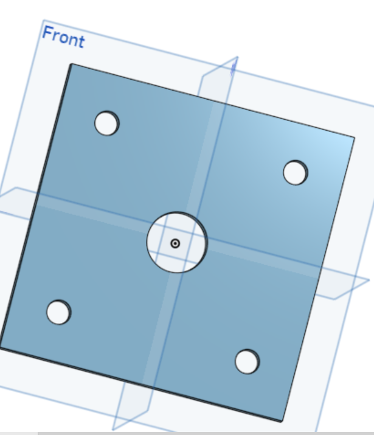
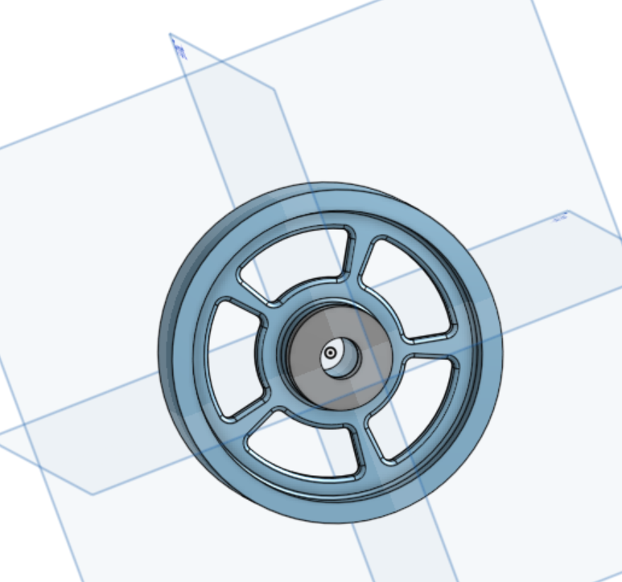

# Basiccad
# BasicCAD

We are creating a caster.

---
## Table of Contents
* [Table of Contents](#Table-of-Contents)
* [Base](#Base)
* [Mount](#Mount)
* [Fork](#Fork)
* [Tire](#Tire)
* [Wheel](#Wheel)
* [AxleCollarBearings](#AxleCollarBearings)

## Base

### Description

The first assignment is to create the caster base.  The base's dimensions are 200 mm x 120 mm and 8 mm thick.  It has 6 holes 10 mm wide and 20 mm from the edge equally spaced along the edges.

### Evidence
[The Base in Onshape](https://cvilleschools.onshape.com/documents/0d70f655203ca304cb3c5b7d/w/f55603f962f6fc74f5548a68/e/41d730c570a8d75fce9f51b6)

### Image
This is how you will write image code for INTERNALLY STORED images on your repo.   just FYI.
~~~

~~~

### Reflection

This was my first Onshape part and [following along with Dr. Shields made it super easy.](https://www.youtube.com/watch?v=93BFUD-HAG8&feature=emb_title&scrlybrkr=5670f0b4)  I learned about 
* sketching (shortcut **shift-s**)
* constructions lines (shortcut **Q**)
* dimensions (shortcut **D**)
* extruding both add and remove (shortcut key **E**)
* linear patterns (no shortcut)

Onshape is awesome.  I found it really helpful to rename all my sketches.  It is going to be a GREAT year in engineering.

---

## Mount

### Description
Today I used my knowledge to create a mount in onshape. It was fairly easy because all I had to do was make a square and cut 5 holes in it.
### Evidence
[The Mount in Onshape](https://cvilleschools.onshape.com/documents/b9c663d0ee404e23ff9782d0/w/411e98a54b550b0af8075053/e/b12a43f9557db3e206539d32)
### Image

### Reflection
This was an easy assignment. Today I remembered how to cut holes in objects. I took me some time, but after playing around with onshape for a while, I finally got it to work.
---

## Fork

### Description
I created a fork to hold a wheel. It is an extruded circle with two holders. Each of the holders has a hole that hold the wheel. The back of the big cylinder had a tube sticking out that in 60mm tall.
### Evidence
https://cvilleschools.onshape.com/documents/b596fc69a54f3fb93bc4808b/w/4485eebf738ffd9e9ce91857/e/7431d8aaf3e5887ba37574ec
### Image

### Reflection
In this assignment I learned how to make circles extrude and then fillet so that they are round on the outside. I also learned how to make a hole in a bigger extrson and that you can extrude some parts of a part without extruding the whole thing.
---

## Wheel

### Description
This assignment was to create a wheel. The wheel had 5 holes with 1mm filets inside of it.
### Evidence
[The wheel in Onshape](https://cvilleschools.onshape.com/documents/2a07f325b613b596a035bf1d/w/2dde90bd7596f079b342f0e4/e/93fd35d51fb99f5d110e23ea)
### Image

### Reflection
In this assignment I learned how to use the fillet feature to fillet multiple things at a time. I also mastered using the symetry feature by making an extrusion symetric.
---

## AxleCollarBearings

### Description
In this assignment I made a bearing on the wheel, a big bearing, and an axle with a collar attached to in.
### Evidence
https://cvilleschools.onshape.com/documents/fe5c96582f86694f2abbfab8/w/b575f351ec4ca1bb6ba54c8b/e/93bf8e0e6a36a3dcc70b5da8
https://cvilleschools.onshape.com/documents/2a07f325b613b596a035bf1d/w/2dde90bd7596f079b342f0e4/e/93fd35d51fb99f5d110e23ea
https://cvilleschools.onshape.com/documents/875ffece27d195bc1b91d1da/w/d5bb4f8e0cc31d0745914bb8/e/f7be987c2e790fcc5255dedf
### Image
<img src="https://cvilleschools.onshape.com/documents/fe5c96582f86694f2abbfab8/w/b575f351ec4ca1bb6ba54c8b/e/93bf8e0e6a36a3dcc70b5da8"
<img src="https://cvilleschools.onshape.com/documents/2a07f325b613b596a035bf1d/w/2dde90bd7596f079b342f0e4/e/93fd35d51fb99f5d110e23ea"
<img src="https://cvilleschools.onshape.com/documents/875ffece27d195bc1b91d1da/w/d5bb4f8e0cc31d0745914bb8/e/f7be987c2e790fcc5255dedf"
### Reflection
In this assignment I learned how to make a flat in an axle. I also learned how to create two different parts in the same document. I also learned ho to name parts in the document. This assignment really help me learn the final building feature that I need to know and I am ready to start my assembly now. 
---

## SubAssembly

### Description
In this assignment I assembled the parts to the wheel. The wheel  has the tire, axle, collar, and bearings.
### Evidence
https://cvilleschools.onshape.com/documents/fd80bad4f533c03ff88d4445/w/8c3fb44705eaf251f75cf16f/e/27cb685d2d5486bf8d0ddcc6
### Image
<img src="https://github.com/ayates67/Basiccad/blob/main/Sub%20assemblyy.PNG"
### Reflection
In this assignment I learned how to assemble the parts. I learned the basic mates and how much easier onshape is than solidworks in my opinion. This assignment took me a little while because at first my axle was a little messed up and so was my mate between the bearing and wheel. I figure it out by percervering and going through all of the possibilities.
---

## FinalAssembly

### Description
In this assignment I finished the caster and assembled everything. I used mostly revolute mates and a few parrelel mates. Every single part that I have made was in this assembly. 
### Evidence
https://cvilleschools.onshape.com/documents/54a282b548986a7d2b44ccc7/w/c1756b15d5fe9ae3c6ec494b/e/064396ad9707a260f582e623
### Image
<img src="https://github.com/ayates67/Basiccad/blob/main/Final%20Assembly.PNG?raw=true"
### Reflection
In this assignment I finally finished the final assembly for the caster. This was by far the hardest assignment in my opinion. I had a messed up fork in the begining so I had to spend 3 days fixing the legs of it. Then I couldn't figure out how to put the pins in so that took me awhile. After days of hard work I got everything to work. This was a big relief to me since it had taken me so long and I had run into so many obstacles but I finally finished.
---

## CollabChallange

### Description
In this project we built 7 parts to make an assembly in onshape. 
### Evidence
https://cvilleschools.onshape.com/documents/a979897320967d215a334cb0/w/7c2fd7da52eb297a2eb2ede4/e/96c2a6d91a80e78f69375dd1
### Image
<img src="https://cvilleschools.onshape.com/documents/a979897320967d215a334cb0/w/7c2fd7da52eb297a2eb2ede4/e/96c2a6d91a80e78f69375dd1"
### Reflection
In this assignment I worked through challenges and worked together with my partners to build 7 parts that fit together. This was a big acomplishment. We ran into some challenges like figuiring out the lengths and widths of the parts but ultimatly got the job done.
---
